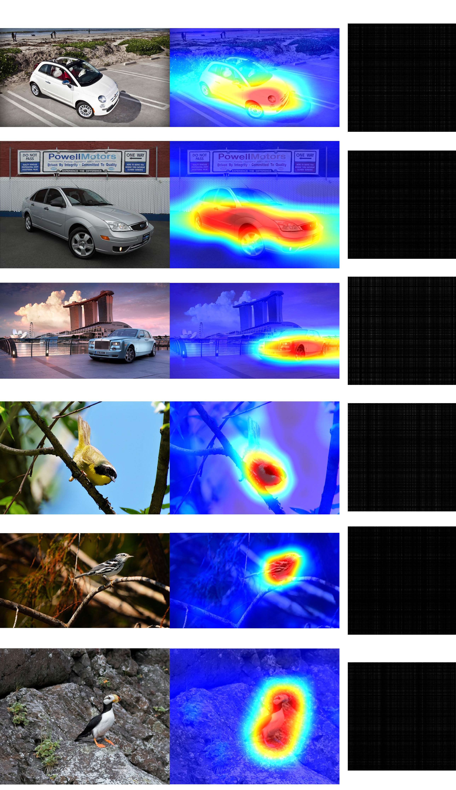
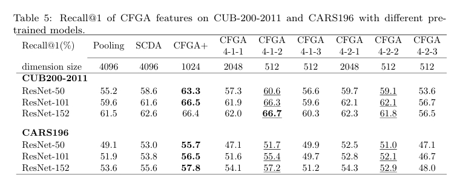
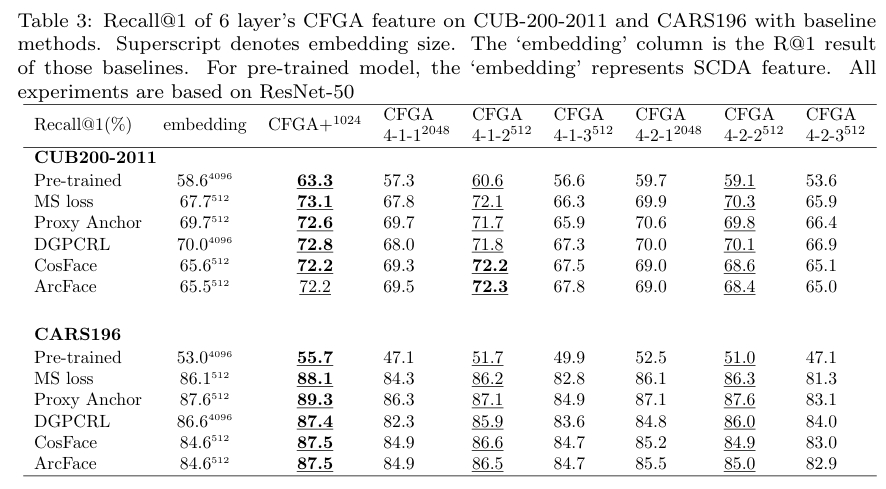
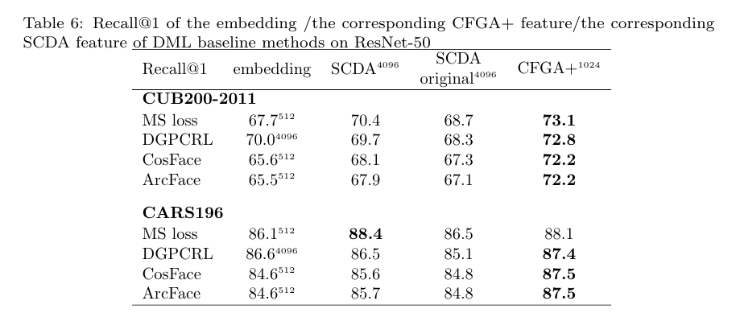

#### Gradient aggregation based fine-grained image retrieval: A unified viewpoint for CNN and Transformer

[2025/06/17] we release the official code for pattern recognition paper [Gradient aggregation based fine-grained image retrieval: A unified viewpoint for CNN and Transformer](https://www.sciencedirect.com/science/article/abs/pii/S0031320323009457)

<!--  -->
 


#### 1.prepare dataset 
* CUB-200-2011
    * download CUB-200-2011 dataset from http://www.vision.caltech.edu/visipedia/CUB-200-2011.html
    * generate dataset of **CFGA-format**
        - adjust **dataset_pth="your dataset savedir"** in step1_prepare_dataset.py
        ````shell
        python step1_prepare_dataset.py
        ````
        ```Python
        import os
        pwd1 = 'cd src'
        dataset_pth=r"C:\Users\于涵\Desktop\Caltech-UCSD Birds-200 2011\Caltech-UCSD Birds-200-2011\CUB_200_2011"
        dataset_name='CUB_200_2011'
        pwd2 = 'python files.py --datasetdir "{}" --dataset_name {}'.format(dataset_pth, dataset_name)
        os.system("{}&&{}".format(pwd1,pwd2))
        ```
* CARS-196
    * download CARS196 dataset from https://ai.stanford.edu/~jkrause/cars/car_dataset.html
    * generate dataset of **CFGA-format**
        ```Python
        import os
        pwd1 = 'cd src'
        #原始图像路径
        dataset_pth=r'C:\Users\于涵\Desktop\Stanford car dataset\car_ims'
        #原始标注路径
        annotationsdir=r'C:\Users\于涵\Desktop\Stanford car dataset\car_devkit\devkit'
        #数据根据标注进行重构，图像按文件夹存储，重构数据的保存路径
        targetdatasetdir = r'E:\dataset\cars196_rearrange_250617'
        dataset_name='cars_196'
        pwd2 = 'python files_cars196.py --datasetdir "{}" --annotationsdir "{}" --targetdatasetdir "{}" --dataset_name {}'.format(dataset_pth, annotationsdir, targetdatasetdir, dataset_name)
        os.system("{}&&{}".format(pwd1,pwd2))
        ```
    * after you have run this procedure, four files with json format will be generated in .\src\datafile, which will be named as train_labels.json, train_paths.json, test_labels.json, test_paths.json, respectively.


#### 2.model-zoo
Because the proposed CFGA method is not an optimization method and it can be combined with certain DML baselines or pertrain models, we provide some trained models to convenient readers (includes some models trained by us ,some [pytorch provided pre-trained models](https://pytorch.org/vision/stable/_modules/torchvision/models/resnet.html) and trained-model provided by [proxy-anchor loss](https://github.com/tjddus9597/Proxy-Anchor-CVPR2020)).
+ CARS196 provided models: [google_drive](https://drive.google.com/drive/folders/17qfulk7GsDxmIb21Df_M-_pvWP1lwLTO)
+ CUB-200-2011 provided models: [google_drive](https://drive.google.com/drive/folders/1XVcAx69vr-irg65fAHJx9mQK89ExBlQL)
+ pytorch pretrained models: [google_drive](https://drive.google.com/drive/folders/1nE37By2q_ABNACaSwdehffgTzd3rL4Fv) or [pytorch_link](https://pytorch.org/vision/stable/_modules/torchvision/models/resnet.html)


#### 3.reimplement_core_experiments

+ imagenet_pretrained_models:
    - R50/R101/R152 + CFGA:
    ````shell
    python step2_re_imagenet_res.py
    ````
    - The minimum execution unit example of the above script is as follows(**CFGA+R50 feature extraction** on the CUB-200-2011 dataset)
    ```Python
    import os
    pwd1 = 'cd src'
    #reimplement_r50+CFGA@cub
    dataset_name='CUB_200_2011'
    model_pth=r'models\resnet50-19c8e357.pth'
    pwd2 = 'python about_pretraineds/WACD_R50.py --model_name {} --dataset_name {}'.format(model_pth,dataset_name)
    os.system("{}&&{}".format(pwd1,pwd2))
    ```
    - **CFGA+R50 feature extraction** on the CARS-196 dataset)
    ```Python
    import os
    pwd1 = 'cd src'
    #reimplement_r50+CFGA@cars-196
    dataset_name='cars_196'
    model_pth=r'models\resnet50-19c8e357.pth'
    pwd2 = 'python about_pretraineds/WACD_R50.py --model_name {} --dataset_name {}'.format(model_pth,dataset_name)
    os.system("{}&&{}".format(pwd1,pwd2))
    ```
    - R50+CFGA@cub-200-2011's feature will saved in *.\src\datafile\CUB_200_2011\models\resnet50-19c8e357_pth*
    - R50+CFGA@cars-196's feature will saved in *.\src\datafile\cars-196\models\resnet50-19c8e357_pth*

+ Deep mertric learning models:
    - MS-loss/CosFace/ArcFace + CFGA:
    ```shell
    python step2_re_dml_res.py
    ```
    ```Python
    import os
    pwd1 = 'cd src'

    # # reimplement_msloss+CFGA@cub
    # dataset_name='CUB_200_2011'
    # dml_method_tag='msloss-512d'
    # model_pth=r'models\cub200\{}\checkpoint_2999_0.2896.pth'.format(dml_method_tag)

    # # reimplement_arcface+CFGA@cub
    # dataset_name='CUB_200_2011'
    # dml_method_tag='arcface-512d'
    # model_pth=r'models\cub200\{}\checkpoint_2800_6.9309_arc.pth'.format(dml_method_tag)


    # reimplement_cosface+CFGA@cub
    dataset_name='CUB_200_2011'
    dml_method_tag='cosface-512d'
    model_pth=r'models\cub200\{}\checkpoint_2800_11.913_cos.pth'.format(dml_method_tag)


    pwd2 = 'python ablation_study/cfga_with_dmls.py --model_name {} --dataset_name {}'.format(model_pth,dataset_name)
    os.system("{}&&{}".format(pwd1,pwd2))

    # # reimplement_msloss+CFGA@cars196
    # dataset_name='cars_196'
    # dml_method_tag='ms-loss-512d'
    # model_pth=r'models\cars196\{}\checkpoint_2800_0.5620.pth'.format(dml_method_tag)


    # # reimplement_arcface+CFGA@cars196
    # dataset_name='cars_196'
    # dml_method_tag='arcface-512d'
    # model_pth=r'models\cars196\{}\checkpoint_3800_7.2521_arc.pth'.format(dml_method_tag)


    # reimplement_cosface+CFGA@cars196
    dataset_name='cars_196'
    dml_method_tag='cosface-512d'
    model_pth=r'models\cars196\{}\checkpoint_3800_9.8567_cos.pth'.format(dml_method_tag)

    pwd2 = 'python ablation_study/cfga_with_dmls.py --model_name {} --dataset_name {}'.format(model_pth,dataset_name)
    os.system("{}&&{}".format(pwd1,pwd2))
    ```
    - proxy-anchor loss + CFGA:
    ```shell
    python step2_re_dml_res.py
    ```
    ```python
    import os
    pwd1 = 'cd src'
    
    # reimplement_proxy_anchor_loss+CFGA@cub
    dataset_name='CUB_200_2011'
    model_pth=r'models\cub200\proxy-anchor-provided-model\cub_resnet50_best.pth'

    pwd2 = 'python WAOCD/WACD_proxy_anchor_trained.py --model_name {} --dataset_name {}'.format(model_pth,dataset_name)
    os.system("{}&&{}".format(pwd1,pwd2))

    # reimplement_proxy_loss+CFGA@cars196
    dataset_name='cars_196'
    model_pth=r'models\cars196\proxy-anchor-provided-model\cars_resnet50_best.pth'

    pwd2 = 'python WAOCD/WACD_proxy_anchor_trained.py --model_name {} --dataset_name {}'.format(model_pth,dataset_name)
    os.system("{}&&{}".format(pwd1,pwd2))

    ```

    - DGPCRL + CFGA:
    ```shell
    python step2_re_dml_res.py
    ```
    ```python
    import os
    pwd1 = 'cd src'
    # reimplement DGPCRL+CFGA@CUB
    dataset_name='CUB_200_2011'
    model_pth=r'models\cub200\DGPCRL\checkpoint_100_0.9998.pth'

    pwd2 = 'python WAOCD\WACD_DGCRL_batch_2.py --model_name {} --dataset_name {}'.format(model_pth,dataset_name)
    os.system("{}&&{}".format(pwd1,pwd2))

    # reimplement DGPCRL+CFGA@CARS
    dataset_name='cars_196'
    model_pth=r'models\cars196\DGPCRL\1\checkpoint_100_0.9934.pth'

    pwd2 = 'python WAOCD\WACD_DGCRL_batch_2.py --model_name {} --dataset_name {}'.format(model_pth,dataset_name)
    os.system("{}&&{}".format(pwd1,pwd2))
    ```
#### 4.calaulate Recall@K/MAP@K
 
- R50/R101/R152 + CFGA:

    ````shell
    python step3_compute_recall_at_k.py
    ````
    - Assume you have already finish the feature-extraction of CFGA, you can test the recall@K perfermance as follows:
    ```Python
    import os
    pwd1 = 'cd src'
    #reimplement_r50+CFGA@cub-200-2011
    dataset_name='CUB_200_2011'
    model_pth=r'models\resnet50-19c8e357.pth'
    pwd2 = 'python WAOCD/compute_recall_as_ms.py {} {}'.format(model_pth, dataset_name)
    os.system("{}&&{}".format(pwd1,pwd2))
    ```
    ```Python
    import os
    pwd1 = 'cd src'
    #reimplement_r50+CFGA@cars196
    dataset_name='cars_196'
    model_pth=r'models\resnet50-19c8e357.pth'

    pwd2 = 'python WAOCD/compute_recall_as_ms.py {} {}'.format(model_pth, dataset_name)
    os.system("{}&&{}".format(pwd1,pwd2))
    ```
    

- DML + CFGA:
    
    ````shell
    python step3_compute_recall_at_k.py
    ````
    ```python
    import os
    pwd1 = 'cd src'
    
    # #reimplement_msloss+CFGA@cub200
    # dataset_name='CUB_200_2011'
    # model_pth=r'models\cub200\msloss-512d\checkpoint_2999_0.2896.pth'


    # #reimplement_arcface+CFGA@cub200
    # dataset_name='CUB_200_2011'
    # model_pth=r'models\cub200\arcface-512d\checkpoint_2800_6.9309_arc.pth'


    #reimplement_cosface+CFGA@cub200
    dataset_name='CUB_200_2011'
    model_pth=r'models\cub200\cosface-512d\checkpoint_2800_11.913_cos.pth'


    pwd2 = 'python WAOCD/compute_recall_as_ms.py {} {}'.format(model_pth, dataset_name)
    os.system("{}&&{}".format(pwd1,pwd2))


    # # reimplement_msloss+CFGA@cars196
    # dataset_name='cars_196'
    # dml_method_tag='ms-loss-512d'
    # model_pth=r'models\cars196\{}\checkpoint_2800_0.5620.pth'.format(dml_method_tag)


    # # reimplement_arcface+CFGA@cars196
    # dataset_name='cars_196'
    # dml_method_tag='arcface-512d'
    # model_pth=r'models\cars196\{}\checkpoint_3800_7.2521_arc.pth'.format(dml_method_tag)


    # reimplement_cosface+CFGA@cars196
    dataset_name='cars_196'
    dml_method_tag='cosface-512d'
    model_pth=r'models\cars196\{}\checkpoint_3800_9.8567_cos.pth'.format(dml_method_tag)

    pwd2 = 'python WAOCD/compute_recall_as_ms.py {} {}'.format(model_pth, dataset_name)
    os.system("{}&&{}".format(pwd1,pwd2))
    ```
    ```python
    import os
    pwd1 = 'cd src'
    
    # reimplement_proxy_anchor_loss+CFGA@cub
    dataset_name='CUB_200_2011'
    model_pth=r'models\cub200\proxy-anchor-provided-model\cub_resnet50_best.pth'

    pwd2 = 'python WAOCD/compute_recall_as_ms.py {} {}'.format(model_pth, dataset_name)
    os.system("{}&&{}".format(pwd1,pwd2))

    # reimplement_proxy_anchor_loss+CFGA@cars196
    dataset_name='cars_196'
    model_pth=r'models\cars196\proxy-anchor-provided-model\cars_resnet50_best.pth'

    pwd2 = 'python WAOCD/compute_recall_as_ms.py {} {}'.format(model_pth, dataset_name)
    os.system("{}&&{}".format(pwd1,pwd2))
    ```
    ```python
    import os
    pwd1 = 'cd src'
    
    # reimplement_DGPCRL+CFGA@cub
    dataset_name='CUB_200_2011'
    model_pth=r'models\cub200\DGPCRL\checkpoint_100_0.9998.pth'

    pwd2 = 'python WAOCD/compute_recall_as_ms.py {} {}'.format(model_pth, dataset_name)
    os.system("{}&&{}".format(pwd1,pwd2))

    # reimplement_DGPCRL+CFGA@cars196
    dataset_name='cars_196'
    model_pth=r'models\cars196\DGPCRL\1\checkpoint_100_0.9934.pth'

    pwd2 = 'python WAOCD/compute_recall_as_ms.py {} {}'.format(model_pth, dataset_name)
    os.system("{}&&{}".format(pwd1,pwd2))
    ```
    
    
    

 
#### 5. Contact

For any questions, please feel free to reach 
```
hello_yuhan@163.com
```

#### 6. Citation

If you use this method or this code in your research, please cite as:

    @article{yu2024gradient,
    title={Gradient aggregation based fine-grained image retrieval: A unified viewpoint for CNN and Transformer},
    author={Yu, Han and Lu, Huibin and Zhao, Min and Li, Zhuoyi and Gu, Guanghua},
    journal={Pattern Recognition},
    volume={149},
    pages={110248},
    year={2024},
    publisher={Elsevier}
    }

#### 7.extra info

- This project only introduces the replication of the most important experimental data in the paper.
- The following project links contain additional details in the paper.
- The following additional items have not been carefully organized and may be somewhat messy.
- If you want to know more about information related to ablation study.
https://github.com/mikiyukio/research-CFGA
- If you want to retrain the metric learning models mentioned in the paper.
https://github.com/mikiyukio/CFGA_CUB200-2011_train
https://github.com/mikiyukio/CFGA_CARS196_train

#### 8.TODO(maybe)

- release our code related to those experiments on swim transformer
- release a demo about image retrieval on cub/cars